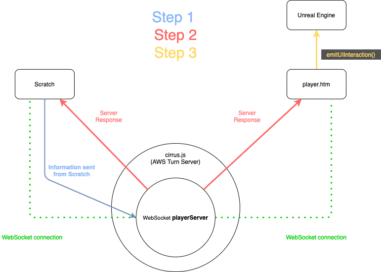

# Table of Contents

## scratch
This folder contains all the scratch code for the blocks

## websocket_stuff
This folder contains all the code for the server-side functionality

## local_server_tests
This folder contains old tests done with a local server. It is pretty much an outdated version of `websocket_stuff`

# Communication Flowchart
Hopefully this is a clear depiction of how information travels from Scratch to Unreal Engine.

1. Information is sent via WebSocket connection to the `playerServer` that then processes the information. 
2. The `playerServer` will then send out an appropriate response to all clients via WebSocket that are connected to it. 
3. When `player.htm` receives the server's response, it will then act accordingly to send information to Unreal Engine

# All README files present in this repo
Here is a list of all the README files that exist for this repo. I suggest you read them all in order to understand how the system works.

[Table of Contents and Communication Flowchart](https://github.com/mitmedialab/PRG-Scratch-Unreal/blob/master/README.md)

[Intro to Scratch Extensions](https://github.com/mitmedialab/PRG-Scratch-Unreal/blob/master/scratch/README.md)

[Simulator Extension Blocks and How They Work](https://github.com/mitmedialab/PRG-Scratch-Unreal/blob/master/scratch/scratch-vm/src/extensions/simulator/README.md)

[Server Side Overview](https://github.com/mitmedialab/PRG-Scratch-Unreal/blob/master/websocket_stuff/server/README.md)

[Local Server Tests - outdated but maybe useful](https://github.com/mitmedialab/PRG-Scratch-Unreal/blob/master/local_server_tests/README.md)
